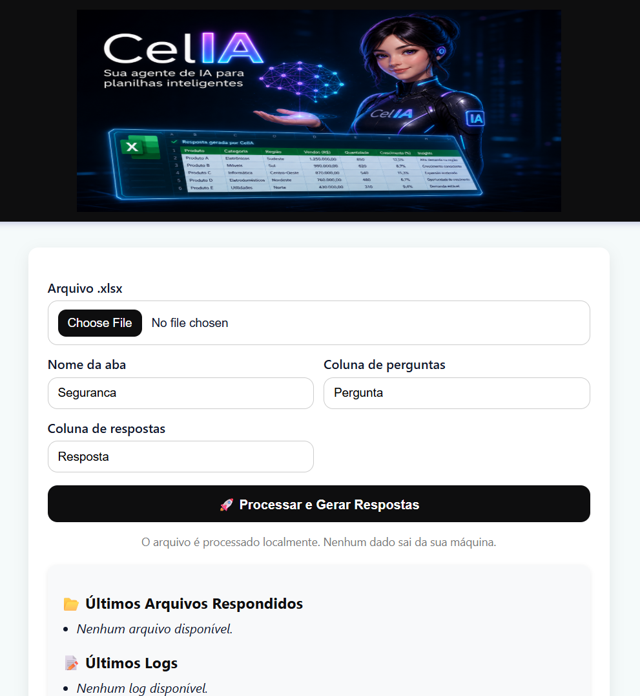

# CelIA

CelIA é uma agente de IA local especializada em responder planilhas Excel de forma inteligente, utilizando arquitetura RAG (Retrieval-Augmented Generation) com Ollama e ChromaDB. A solução processa os dados diretamente na máquina local, sem enviar informações para serviços externos, garantindo maior privacidade, segurança e controle dos dados.

## Índice

- [Requisitos](#requisitos)
- [Configuração mínima](#configuração-mínima)
- [Interface principal](#interface-principal)
- [Executar com Docker (recomendado)](#executar-com-docker-recomendado)
- [URLs locais](#urls-locais)
- [Executar sem Docker (opcional)](#executar-sem-docker-opcional)
- [Observações importantes](#observações-importantes)

---

## Requisitos

- Windows 10 ou 11 (64 bits)
- WSL 2 com Ubuntu 22.04+
- Docker Desktop 4.30+ com suporte a WSL 2
- Python 3.11+ (opcional, apenas para execução sem Docker)

---

## Configuração mínima

1. Copie o arquivo de variáveis de ambiente do Docker:

```bash
cp .env.example .env
```

2. Copie o arquivo de configuração do app Python:

```bash
cp wsl/settings.example.env wsl/settings.env
```

3. Em `wsl/settings.env`, defina pelo menos:

- `OLLAMA_URL=http://localhost:11434`
- `UPLOADER_PASSWORD=<senha-forte-aqui>`

4. Para embeddings:

- `USE_LOCAL_EMBEDDINGS=1` → embeddings locais com HuggingFace
- `USE_LOCAL_EMBEDDINGS=0` → embeddings via Ollama

---

## Interface principal



A interface principal da aplicação é a API local do uploader, que expõe o serviço web para ingestão e consulta de planilhas Excel.

A CELIA responde perguntas sobre a planilha com base nos dados armazenados no banco vetorial ChromaDB. Para que ela possa responder corretamente, é necessário informar:

- a coluna da pergunta
- a coluna da resposta
- a aba (sheet) da planilha que será verificada

---

## Executar com Docker (recomendado)

1. No terminal WSL, vá para o diretório do projeto:

```bash
cd /mnt/c/Usuario/CelIA
```

2. Baixe a imagem do Ollama:

```bash
docker pull ollama/ollama:latest
```

3. Suba os containers:

```bash
docker compose up -d --build
```

Os containers criados serão:

- `celia-ollama`
- `celia-openwebui`
- `celia-uploader`

4. Ingestão da base de conhecimento:

```bash
docker compose exec uploader python excel_rag.py ingest --dir /knowledge
```

---

## URLs locais

- Upload de planilhas / API: `http://localhost:8084`
- Ollama API: `http://localhost:11434`
- OpenWebUI (opcional): `http://localhost:3000`

---

## Executar sem Docker (opcional)

1. Entre em `wsl`:

```bash
cd /mnt/c/Usuario/CelIA/wsl
```

2. Crie e ative um ambiente virtual:

```bash
python3 -m venv .venv
source .venv/bin/activate
```

3. Instale dependências:

```bash
pip install -r requirements.txt
```

4. Inicie a API local:

```bash
uvicorn web_upload:app --reload --port 8081
```

> Esse modo exige uma instância Ollama local disponível em `OLLAMA_URL`.

---

## Observações importantes

- Nunca comite `wsl/settings.env` ou `.env` no repositório.
- Mantenha `OLLAMA_URL` apontando para `localhost` para processamento local.
- O serviço `uploader` e o Ollama devem estar na mesma rede local.